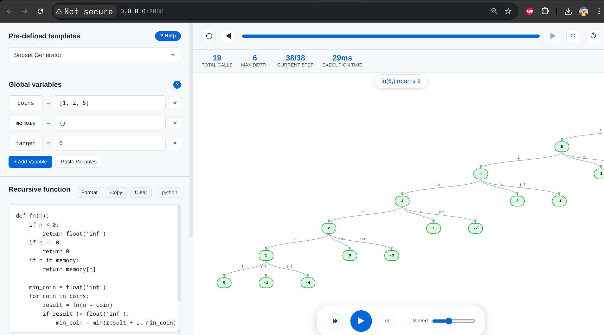

# Recursive Lens

An interactive, browser-based tool to visualize Python recursive function call trees in real time — powered by Pyodide. No server, no install, just open and run.



---

## Features

- Run real Python code directly in the browser (via [Pyodide](https://pyodide.org))
- Visual call tree with animated step-by-step execution
- Zoom toward cursor, smooth pan, and pinch-to-zoom on touch devices
- Return values displayed on edges
- Built-in templates: Fibonacci, Subsets, Permutations, N-Queens, Knapsack, LCS, Coin Change
- Paste multiple global variables at once
- Dark mode, speed control, output console
- Works completely offline after first load

---

## Getting Started

Since the app uses Pyodide (which loads via CDN), it must be served over HTTP — not opened as a plain file.

### Run locally

```bash
cd recursion-visualizer
python3 -m http.server 8000
```

Then open [http://localhost:8000](http://localhost:8000) in your browser.

> The first load downloads Pyodide (~10 MB). Subsequent loads are cached.

---

## How to Use

### 1. Pick a template or write your own

Use the **Pre-defined templates** dropdown to load a working example, or select **Custom Function** to write from scratch.

### 2. Set global variables

Variables listed in the **Global variables** panel are available inside your function as globals.

**Add one at a time** using `+ Add Variable`, or **paste a block** using `Paste Variables`:

```
coins = [1, 2, 5]
target = 11
memo = {}
```

Click **Apply** — all variables are loaded instantly.

### 3. Write your recursive function

Your function **must be named `fn`**. Use standard Python syntax with 4-space indentation.

```python
def fn(i, curr):
    if i == len(arr):
        return curr[:]

    curr.append(arr[i])
    with_item = fn(i + 1, curr)

    curr.pop()
    without_item = fn(i + 1, curr)

    return [with_item, without_item]
```

**Tips:**
- Press `Tab` for 4-space indent, `Shift+Tab` to dedent
- Press `Ctrl+Enter` to run immediately
- Use `print(...)` to log to the output console

### 4. Set the function call

Enter your entry-point call in the box at the bottom of the left panel, e.g. `fn(0, [])`.

### 5. Run

Click the **Run** button (or press `Ctrl+Enter`). The call tree appears on the right.

---

## Navigating the Tree

| Action | How |
|---|---|
| Pan | Click and drag |
| Zoom | Scroll wheel (zooms toward cursor) |
| Fine zoom | `Ctrl` + scroll |
| Pinch zoom | Two-finger pinch (touch devices) |
| Reset view | Click the reset zoom button (↺) |
| Step through | Use Prev / Next or the playback controls |

---

## Converting Existing Code

If your function uses inner functions, classes, or decorators, see [`CONVERT_PROMPT.md`](CONVERT_PROMPT.md). Paste its contents along with your code into any LLM and it will rewrite your function into a compatible flat form automatically.

---

## Project Structure

```
recursion-visualizer/
├── index.html          # UI layout and help modal
├── script.js           # Pyodide runner, tree builder, SVG renderer, zoom/pan
├── styles.css          # Theming, layout, node and edge styles
├── CONVERT_PROMPT.md   # LLM prompt to convert any Python recursion code
└── images/
    └── image.png       # App screenshot
```

---

## Tech Stack

- **[Pyodide](https://pyodide.org)** — CPython compiled to WebAssembly
- Vanilla HTML, CSS, JavaScript — zero dependencies, zero build step
- SVG for tree rendering with a Reingold-Tilford-style layout algorithm
